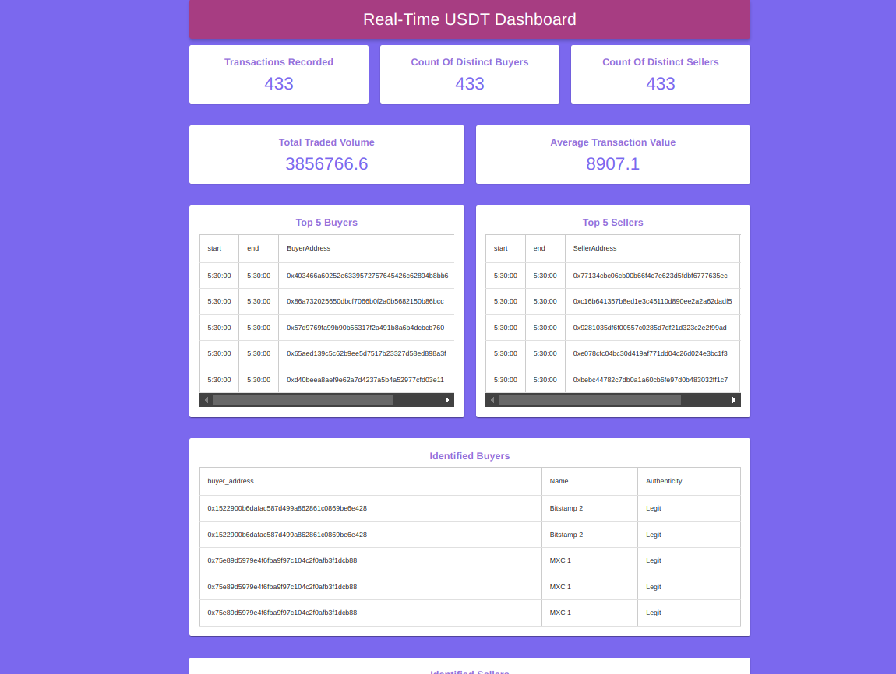

# Real-Time USDT Dashboard


## To Run

1. Clone the repo
2. Install dependencies
```bash 
pnpm install
```
3. Start dozer live (if you want to use dozer run, change the port in DozerProvider component)
```bash
dozer live
```
4. Run the dev server
```bash
pnpm run dev
```

